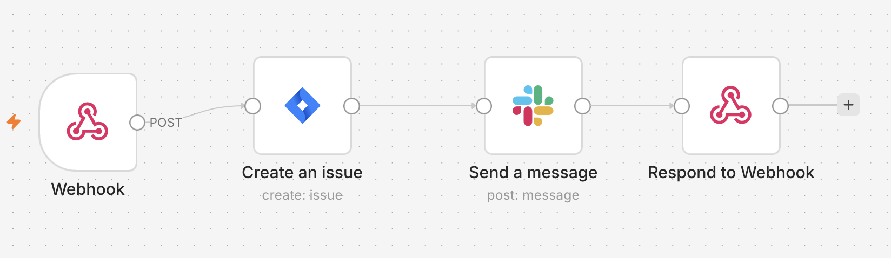

# Proposal Scorer — SiviHack 2026, Track 1

**Nhà tài trợ đề bài:** FPT Software Europe.

## 1. Sản phẩm là gì

Các team sales của FPT viết rất nhiều proposal cho khách hàng doanh nghiệp
(DACH/EU, mảng cloud/AI). Trước khi gửi đi, một người cấp cao phải đọc lại
proposal và đối chiếu với RFP của khách — kiểm tra xem có thiếu yêu cầu nào
không, giá/timeline có mập mờ không, có hứa hẹn vượt quá năng lực thực tế
không. Việc này làm bằng tay, không đều, và thường bị dồn sát deadline.

**Proposal Scorer** là một trợ lý AI đóng vai người review đó: người dùng đưa
vào 1 RFP + 1 bản proposal nháp, hệ thống trả về trong khoảng 30 giây:

- **Điểm theo 7 tiêu chí** (Problem Understanding, Scope & Deliverables,
  Pricing Clarity, Timeline Clarity, Completeness vs RFP, Tone &
  Persuasiveness, Risk/Assumptions Transparency), có thể tuỳ biến thêm/xoá/đổi
  mức độ quan trọng.
- **Từng yêu cầu trong RFP** được đối chiếu riêng: đã đáp ứng / mập mờ / thiếu
  / mâu thuẫn — kèm trích dẫn nguyên văn từ cả RFP và proposal, và một câu sửa
  cụ thể (không chỉ nói "chưa rõ", mà viết luôn đoạn thay thế).
- **Cảnh báo cứng**: nếu proposal vi phạm một ràng buộc RFP nêu rõ (ví dụ RFP
  nói "không di dời database" mà proposal lại đề xuất di dời), hệ thống luôn
  đánh dấu mức nghiêm trọng cao — không để văn phong tự tin của proposal che
  mất vi phạm.
- **Đối chiếu với kho tri thức nội bộ công ty** (rate card, năng lực thực tế,
  chuẩn SLA) — bắt được những cam kết mà RFP không thể tự phát hiện, ví dụ hứa
  trực 24/7 trong khi công ty không có nhân sự, hoặc báo giá dưới sàn giá nội
  bộ.
- **Gửi việc cho team**: nút "Send to Work" tạo thẳng 1 ticket Jira kèm tóm tắt
  vấn đề và báo vào Slack của team.

Đây **không phải** một tool tự viết proposal — nó chỉ review và góp ý cho một
bản đã có sẵn.

## 2. Chạy demo — từ máy trắng đến có kết quả

### 2.1. Yêu cầu

- Python 3.10+ (khuyến nghị 3.11+), Node.js 18+.
- 1 API key Gemini (Google AI Studio) — miễn phí, lấy tại
  [aistudio.google.com/apikey](https://aistudio.google.com/apikey).
- Máy trống RAM/đĩa: lần chạy đầu tiên tải model embedding cục bộ
  `all-MiniLM-L6-v2` (~90 MB) — cần mạng lần đầu, sau đó chạy hoàn toàn local.

### 2.2. Backend

```bash
cd backend
python3 -m venv .venv
source .venv/bin/activate        # Windows: .venv\Scripts\activate
pip install -r requirements.txt

cp .env.example .env             # rồi mở .env, điền GEMINI_API_KEY (bắt buộc)
uvicorn main:app --reload --port 8000
```

Kiểm tra đã lên đủ module:

```bash
curl http://localhost:8000/api/health
```

```json
{
  "status": "ok",
  "modules": {
    "markitdown": true, "enterprise_evidence": true, "scoring_rag": true,
    "internal_knowledge": true, "analyze_rfp": true, "score": true
  }
}
```

Module nào `false` không chặn app chạy — chỉ tắt riêng tính năng đó (ví dụ
`markitdown: false` thì mất khả năng đọc PDF/Word, phần chấm điểm chính vẫn
hoạt động với văn bản dán trực tiếp).

### 2.3. Frontend

```bash
cd frontend
npm install
npm run dev
```

Mở [http://localhost:5173](http://localhost:5173).

### 2.4. Thử một lượt review đầy đủ

1. Ở màn **Documents**, bấm 1 trong 4 chip mẫu (Weak/Medium/Strong/
   Overpromising) — hoặc dán/kéo-thả RFP + proposal của riêng bạn (PDF, Word,
   PowerPoint, Excel, ảnh, hoặc `.md`/`.txt`).
2. Bấm **"Review this proposal"** — đợi ~10-15 giây (RFP Analyst đọc RFP).
3. Màn **Criteria**: xem AI đề xuất tiêu chí + mức độ quan trọng (High/Medium/
   Low). Kéo-thả hoặc bấm mũi tên để đổi cột, thêm/xoá tiêu chí theo ý bạn.
4. Bấm **"Score the proposal"** — đợi ~15-20 giây (Proposal Analyst chấm
   điểm).
5. Màn **Result**: điểm tổng + khuyến nghị gửi hay không, điểm từng tiêu chí,
   danh sách yêu cầu kèm trích dẫn và câu sửa, cảnh báo từ kho tri thức nội bộ
   (nếu có). Bấm **"Send to Work"** để tạo ticket Jira + báo Slack (cần cấu
   hình ở mục 3).

Nếu backend chưa chạy hoặc lỗi, frontend tự hiện lại kết quả mẫu đã lưu sẵn
kèm nhãn "Stored sample result" — demo không bao giờ chết đứng.

## 3. Cấu hình `backend/.env`

Copy từ `backend/.env.example`, không commit file `.env` thật (đã có trong
`.gitignore`).

| Biến | Bắt buộc? | Ý nghĩa |
|---|---|---|
| `GEMINI_API_KEY` | **Có** | Key gọi Gemini cho cả 2 agent. Ngân sách chung cả team có hạn (xem mục 7). |
| `GEMINI_MODEL` | Không (mặc định `gemini-3.8-flash`) | `gemini-2.0-flash` đã bị Google gỡ khỏi API, đừng dùng lại. |
| `AI_PROVIDER` | Không (mặc định `gemini`) | Đổi thành `anthropic` để chuyển hẳn sang Claude nếu hết ngân sách Gemini — cần điền thêm `ANTHROPIC_API_KEY`. |
| `RFP_ANALYST_MODEL`, `RFP_ANALYST_ATTEMPTS` | Không | Model + số lần thử lại riêng cho RFP Analyst khi model trích dẫn sai nguyên văn. |
| `ANTHROPIC_API_KEY`, `AI_MODEL` | Không | Chỉ cần khi `AI_PROVIDER=anthropic`. |
| `N8N_TICKET_WEBHOOK_URL` | Không (tính năng tuỳ chọn) | URL Webhook của workflow n8n (Webhook → Jira → Slack). Không điền thì nút "Send to Work" báo lỗi nhưng không ảnh hưởng phần chấm điểm. Xem `docs/api/review-contract.md` mục 5 để dựng workflow. |

## 4. Kiến trúc & công nghệ

```
Frontend (React)
   │  POST /api/analyze-rfp
   ▼
RFP Analyst  (LangChain + Gemini, structured output)
   │  requirements, hard constraints, tiêu chí đề xuất
   ▼
[Người dùng duyệt/sửa tiêu chí — không tốn lượt gọi model]
   │  POST /api/score
   ▼
Proposal Analyst / Scoring Agent  (Gemini SDK trực tiếp)
   │  + RAG hybrid (chỉ để hiệu chỉnh văn phong, không quyết định "đủ yêu cầu")
   │  + Kho tri thức nội bộ (so khớp chuỗi, không gọi model)
   ▼
overall_score (tính bằng code, không phải LLM) + findings + verdict
   │  POST /api/create-ticket (tuỳ chọn)
   ▼
n8n → Jira (tạo ticket) → Slack (báo team)
```

| Lớp | Công nghệ | Vai trò |
|---|---|---|
| Frontend | React 18 + Vite | UI 3 màn: Documents → Criteria → Result |
| Backend | FastAPI + Uvicorn + Pydantic v2 | Route HTTP, validate schema, nối 2 agent |
| RFP Analyst | LangChain (`langchain-google-genai`) + Gemini, structured output | Trích yêu cầu, ràng buộc cứng, đề xuất tiêu chí — 1 lượt gọi model |
| Proposal Analyst | Gemini SDK trực tiếp (`google-generativeai`) | Chấm 7 tiêu chí + đối chiếu từng yêu cầu — 1 lượt gọi model, có retry tự sửa JSON lỗi |
| RAG hiệu chỉnh văn phong | Keyword overlap + `sentence-transformers/all-MiniLM-L6-v2` chạy local (hybrid) | Chỉ hỗ trợ 4/7 tiêu chí mang tính chủ quan (Pricing/Timeline/Tone/Risk); không chạm tới các tiêu chí về "đủ yêu cầu" |
| Kho tri thức nội bộ | So khớp chuỗi thuần (không gọi model) | Bắt cam kết vượt năng lực thực tế / giá dưới rate card — thứ RFP không thể tự phát hiện |
| Đọc file | `markitdown` (+ Gemini OCR cho ảnh) | PDF/Word/PowerPoint/Excel/ảnh → Markdown |
| Automation | n8n Cloud → Jira → Slack | Nút "Send to Work", tuỳ chọn |

### 4.1. Workflow n8n (nút "Send to Work")

`Webhook → Jira: Create Issue → Slack: Send a message → Respond to Webhook`
— khi bấm "Send to Work" ở màn Result, backend POST kết quả chấm điểm tới
Webhook này; n8n tạo 1 ticket Jira tóm tắt các finding mức độ nghiêm trọng
trung bình/cao trở lên, rồi báo link ticket đó vào Slack, tag `<!channel>`.



Cách dựng lại workflow này và lấy Webhook URL: `docs/api/review-contract.md`
mục 5.

## 5. API chính

| Endpoint | Việc gì |
|---|---|
| `GET /api/health` | Trạng thái từng module |
| `POST /api/analyze-rfp` | RFP Analyst — input RFP, output `rfp_analysis` + tiêu chí đề xuất |
| `POST /api/confirm-criteria` | Chốt tiêu chí sau khi người dùng sửa (gộp trùng, nối tiêu chí tự thêm vào RFP) |
| `POST /api/score` | Proposal Analyst — chấm điểm, trả `scoring` |
| `POST /api/create-ticket` | Gửi kết quả sang n8n để tạo ticket Jira + báo Slack |
| `POST /v1/markitdown/convert` | Chuyển PDF/Word/PowerPoint/Excel/ảnh sang Markdown |
| `POST /rag/retrieve` | Truy vấn trực tiếp kho benchmark (dùng cho debug) |
| `GET/POST /api/evidence/*` | Kho tri thức nội bộ: tìm kiếm, kiểm tra cam kết, xem tài liệu nguồn |

Chi tiết schema từng field: `docs/api/review-contract.md`.

## 6. Dataset & thư viện chính

**Dataset:**
- `docs/challenge/sample_data/` — 1 RFP (NordFrame Logistics) + 4 proposal mẫu
  (weak/medium/strong/overpromise) + 1 ví dụ output chuẩn (`scoring_example.md`)
  dùng để hiệu chỉnh prompt.
- `proposal_scorer_benchmark/` — 6 RFP giả lập ở 6 ngành khác nhau × 4 response
  = 24 cặp, dùng để mở rộng kho heuristics viết-tốt/viết-tệ cho RAG (không
  phải dữ liệu NordFrame, để không học tủ theo 1 case).
- `backend/rag/data/records.jsonl` — 557 đoạn benchmark đã băm nhỏ từ 2 nguồn
  trên, kèm vector embedding tương ứng trong `embeddings.npz`.

**Thư viện chính** (đầy đủ: `backend/requirements.txt`, `frontend/package.json`,
`agent/pyproject.toml`):

| Thư viện | Dùng cho |
|---|---|
| `fastapi`, `uvicorn`, `pydantic` | Backend API + validate schema |
| `google-generativeai` | Gọi Gemini trực tiếp (Proposal Analyst) |
| `langchain-google-genai` | Gọi Gemini với structured output (RFP Analyst) |
| `anthropic` | Provider dự phòng khi đổi `AI_PROVIDER=anthropic` |
| `sentence-transformers`, `numpy` | Embedding local cho RAG hybrid, không gọi API ngoài |
| `markitdown[pdf,docx,pptx,xlsx,xls]` | Chuyển đổi tài liệu sang Markdown |
| `python-multipart` | Nhận file upload qua FastAPI |
| `react`, `vite` | Frontend |

## 7. Giới hạn hiện tại

- **Ngân sách Gemini chung cả team, giới hạn $100** — mỗi lượt review tốn 2
  lượt gọi model (RFP Analyst + Proposal Analyst); hết ngân sách phải đổi
  `AI_PROVIDER=anthropic` trong `.env`.
- **RAG hybrid phụ thuộc `sentence-transformers`/`torch`** — cài đặt nặng
  (có thể mất vài phút, vài trăm MB) và cần mạng ở lần tải model đầu tiên. Nếu
  thiếu thư viện hoặc không có mạng, hệ thống tự lùi về so khớp từ khoá thuần,
  không dừng app.
- **Chất lượng đọc PDF/ảnh phụ thuộc `markitdown` và Gemini OCR** — tài liệu
  scan mờ hoặc layout phức tạp có thể trích sai đoạn văn.
- **Đã kiểm thử trên RFP giả lập** (NordFrame + 24 cặp benchmark), chưa kiểm
  thử trên RFP thật của khách hàng ngoài đời — prompt được thiết kế để tổng
  quát hoá (không hard-code theo NordFrame) nhưng chưa có số liệu trên dữ liệu
  thật.
- **Tính năng "Send to Work" cần dựng workflow n8n bằng tay trước** (Webhook →
  Jira → Slack) — không tự động tạo workflow, xem `docs/api/review-contract.md`
  mục 5.
- **Không có cơ chế timeout/huỷ giữa chừng** cho lượt gọi Gemini — nếu model
  phản hồi chậm bất thường, người dùng phải chờ hoặc tải lại trang (kết quả
  mẫu sẽ hiện ra thay thế).

## 8. Bảo mật

- `backend/.env` đã có trong `.gitignore` — **không commit, không paste key
  lên Slack/Discord/Zalo công khai.**
- Toàn bộ dữ liệu mẫu (RFP, proposal, tên công ty) đều là giả lập, không phải
  dữ liệu khách hàng thật.
- Voucher n8n Cloud Pro (nếu cần dựng workflow automation): kích hoạt theo
  hướng dẫn BTC gửi, mã `2026-COMMUNITY-HACKATHON-FRANKFURT-9AA2EB02`.

## 9. Tài liệu liên quan

- Đề bài đầy đủ: `docs/challenge/track-1-proposal-scorer.pdf`
- Contract API chi tiết (field-by-field): `docs/api/review-contract.md`
- Logic chấm điểm, schema, quyết định kiến trúc: `CLAUDE.md`
- RFP Analyst (package riêng): `agent/README.md`
- RAG hybrid: `backend/rag/README.md`

## 10. Giấy phép

MIT — xem `LICENSE`. Bản quyền đứng tên chung *SiviHack 2026 Proposal Scorer
contributors*, không riêng một người, vì repo có nhiều người viết.

Dữ liệu mẫu trong `docs/challenge/` là tài liệu của BTC/nhà tài trợ, không thuộc
giấy phép này.
